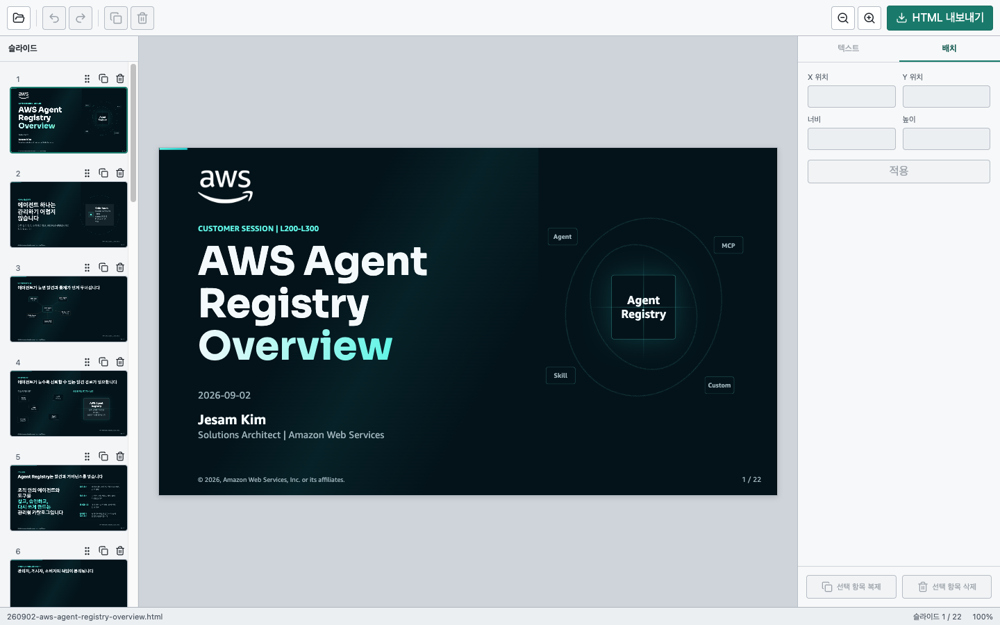

# HTML Slide Editor

신뢰할 수 있는 self-contained `html-slide` HTML 덱을 브라우저에서 편집하고 새 HTML 파일로 내보내는 local-first 편집기입니다. 원본 파일을 덮어쓰거나 사용자 문서를 서버에 업로드하지 않습니다.



## 주요 기능

- HTML 덱을 슬라이드 단위로 탐색하고 순서를 변경합니다.
- 개체를 선택해 이동, 크기 조정, 복제, 삭제할 수 있습니다.
- 텍스트 내용과 일부 서식을 편집할 수 있습니다.
- 실행 취소와 다시 실행을 지원합니다.
- 기존 스크립트, 스타일, 내장 자산을 보존한 HTML 사본을 내보냅니다.
- 브라우저의 IndexedDB에 복구용 작업 상태를 저장합니다.

편집기는 기존 `html-slide` 엔진과 문서 구조를 유지합니다. 외부 또는 상대 경로 자산은 HTML에 새로 포함하지 않으며, 브라우저가 문서를 파싱하고 직렬화하므로 결과가 원본과 byte-for-byte로 같지는 않습니다.

## 빠른 시작

로컬 실행에는 AWS 계정이나 AWS 자격 증명이 필요하지 않습니다.

### 요구 사항

- Node.js `20.19.0` 이상 또는 `22.12.0` 이상
- npm

```bash
git clone https://github.com/jesamkim/html-slide-editor.git
cd html-slide-editor
npm ci
npm run dev
```

Vite가 출력한 주소를 열고 다음 순서로 사용합니다.

1. **HTML 열기**에서 로컬 `html-slide` 파일을 선택합니다.
2. 개체를 클릭해서 선택하고 텍스트를 더블클릭해서 편집합니다.
3. 캔버스 또는 Inspector에서 위치, 크기, 텍스트 서식을 바꿉니다.
4. 왼쪽 슬라이드 목록에서 이동, 복제, 삭제 작업을 수행합니다.
5. **HTML 내보내기**를 선택해서 `<원본이름>-edited.html`을 내려받습니다.

## AWS 배포

AWS에 배포할 때만 CDK 패키지를 설치합니다.

```bash
npm --prefix infra ci
```

CDK 스택은 다음 구조를 만듭니다.

```text
Browser ──HTTPS──> CloudFront ──OAC──> Private S3
   └────────────── Cognito Hosted UI
```

- S3 Block Public Access를 모두 활성화합니다.
- CloudFront만 Origin Access Control을 통해 S3 객체를 읽습니다.
- HTTP 요청은 HTTPS로 전환합니다.
- Cognito self-signup을 비활성화하고 관리자가 사용자를 생성합니다.
- 앱은 배포 시 생성한 `auth-config.json`으로 Cognito 설정을 읽습니다.

### 자격 증명 준비

배포 스크립트는 access key, secret key, session token을 인자로 받거나 파일에 저장하지 않습니다. AWS CLI의 표준 profile을 사용하며, AWS IAM Identity Center를 사용할 수 있다면 SSO profile을 권장합니다.

```bash
aws configure sso --profile coworker-dev
aws sso login --profile coworker-dev
```

profile에는 CloudFormation, CDK bootstrap, S3, CloudFront, Cognito 리소스를 만들 수 있는 권한이 필요합니다. 필요한 권한은 조직의 계정과 permission set 정책에 맞춰 부여해야 합니다.

### 대상 확인

배포에 사용할 값을 셸 변수로 정합니다. `HSE_ACCOUNT`는 계정 소유자, AWS 콘솔, 사내 계정 관리 시스템처럼 profile의 STS 응답과 독립된 출처에서 확인한 12자리 ID로 바꿔야 합니다.

```bash
HSE_PROFILE=coworker-dev
HSE_REGION=ap-northeast-2
HSE_ACCOUNT=123456789012
HSE_STACK=HtmlSlideEditorStack
```

profile이 가리키는 account를 확인합니다.

```bash
aws sts get-caller-identity \
  --profile "$HSE_PROFILE" \
  --query "{Account:Account,Arn:Arn}" \
  --output table
```

출력된 account ID가 배포하려는 계정과 같은지 별도로 확인한 뒤 `--account`에 입력합니다. 배포 스크립트는 profile이 가리키는 account와 `--account`가 다르면 중단합니다.

dry run으로 AWS STS가 확인한 account, principal, region과 실행할 명령을 다시 확인합니다.

```bash
npm run infra:deploy -- \
  --profile "$HSE_PROFILE" \
  --region "$HSE_REGION" \
  --account "$HSE_ACCOUNT" \
  --stack-name "$HSE_STACK" \
  --dry-run
```

스크립트는 profile의 기본 region에 의존하지 않고 명시한 region을 `AWS_REGION`, `AWS_DEFAULT_REGION`, `CDK_DEFAULT_REGION`에 동일하게 적용합니다.

### CDK bootstrap

대상 account/region 조합에서 처음 CDK를 사용한다면 bootstrap을 별도로 실행합니다.

```bash
npm run infra:bootstrap -- \
  --profile "$HSE_PROFILE" \
  --region "$HSE_REGION" \
  --account "$HSE_ACCOUNT"
```

bootstrap은 AWS 계정에 리소스를 만들기 때문에 deploy 과정에서 자동으로 실행하지 않습니다.

### 배포

```bash
npm run infra:deploy -- \
  --profile "$HSE_PROFILE" \
  --region "$HSE_REGION" \
  --account "$HSE_ACCOUNT" \
  --stack-name "$HSE_STACK"
```

배포 명령은 다음 순서로 실행됩니다.

1. STS로 account와 principal을 확인합니다.
2. 앱과 CDK 패키지를 빌드합니다.
3. `cdk synth`와 `cdk diff`를 실행합니다.
4. account ID를 화면에 표시하고 사용자에게 확인을 요청합니다.
5. 확인 후 `cdk deploy`를 실행합니다.

기본 stack 이름은 `HtmlSlideEditorStack`입니다. Cognito Hosted UI prefix는 account, region, stack 이름으로 만든 해시를 포함하므로 account ID를 그대로 노출하지 않고 같은 계정의 여러 스택을 구분합니다. 첫 배포에서 prefix가 이미 사용 중이면 값을 바꿀 수 있습니다.

```bash
HSE_STACK=MyHtmlSlideEditor

npm run infra:deploy -- \
  --profile "$HSE_PROFILE" \
  --region "$HSE_REGION" \
  --account "$HSE_ACCOUNT" \
  --stack-name "$HSE_STACK" \
  --domain-prefix my-html-slide-editor-unique
```

비대화형 환경에서는 검토한 dry run과 동일한 인자에 `--yes`를 추가할 수 있습니다. 이 옵션은 배포 확인과 CDK의 IAM 변경 승인을 건너뛰므로 CI처럼 account와 권한 경계가 별도로 통제되는 환경에서만 사용합니다.

배포 스크립트는 새 stack에 `html-slide-editor:managed-by=html-slide-editor-deploy` tag를 추가합니다. 같은 이름의 stack이 이미 있지만 이 tag가 없으면 다른 애플리케이션을 수정하지 않도록 배포를 중단합니다.

Hosted UI prefix는 stack을 만든 뒤에는 바꿀 수 없습니다. 배포 스크립트는 기존 stack의 `HostedUiDomain` 출력과 새 prefix가 다르면 update를 중단합니다. 이 배포 스크립트를 도입하기 전에 만든 기존 stack은 소유권 tag와 prefix 규칙이 다르므로 기본 명령으로 update하지 마세요. 기존 stack은 그대로 두고 새 stack 이름으로 배포하거나, 기존 domain과 리소스를 확인한 뒤 별도 마이그레이션 계획을 세워야 합니다.

### Cognito 사용자 생성

배포는 로그인 사용자를 자동으로 만들지 않습니다. CloudFormation 출력의 `UserPoolId`를 확인한 뒤 Cognito 콘솔에서 사용자를 만들거나 AWS CLI를 사용합니다.

```bash
USER_POOL_ID="$(aws cloudformation describe-stacks \
  --stack-name "$HSE_STACK" \
  --query "Stacks[0].Outputs[?OutputKey=='UserPoolId'].OutputValue | [0]" \
  --output text \
  --profile "$HSE_PROFILE" \
  --region "$HSE_REGION")"

aws cognito-idp admin-create-user \
  --user-pool-id "$USER_POOL_ID" \
  --username coworker@example.com \
  --user-attributes \
    Name=email,Value=coworker@example.com \
    Name=email_verified,Value=true \
  --profile "$HSE_PROFILE" \
  --region "$HSE_REGION"
```

사용자는 Cognito가 전달한 임시 비밀번호로 로그인한 뒤 새 비밀번호를 설정합니다. 비밀번호를 명령줄, 저장소, README에 기록하지 마세요.

임시 비밀번호는 7일 동안 유효합니다. 기간이 지났다면 관리자가 사용자를 다시 초대하거나 Cognito의 관리자 비밀번호 재설정 절차를 수행해야 합니다.

### 삭제와 비용

CloudFront, S3, Cognito 사용량에 따라 비용이 발생할 수 있습니다. 스택을 삭제하려면 먼저 CloudFormation 출력과 보존할 데이터를 확인한 뒤 CDK를 실행합니다.

```bash
npm run infra:destroy -- \
  --profile "$HSE_PROFILE" \
  --region "$HSE_REGION" \
  --account "$HSE_ACCOUNT" \
  --stack-name "$HSE_STACK"
```

삭제 명령은 `--yes`를 허용하지 않으며 확인 단계에서 stack 이름을 직접 입력해야 합니다. S3 bucket과 Cognito User Pool에는 `RemovalPolicy.RETAIN`을 적용했고 User Pool의 deletion protection을 활성화했습니다. 스택을 삭제해도 두 리소스는 남습니다. 더 이상 필요하지 않다면 내용을 확인한 뒤 S3 bucket을 비우고 삭제합니다. Cognito User Pool은 deletion protection을 비활성화한 뒤 삭제해야 합니다.

## 보안 경계

- 로컬 AWS 자격 증명은 AWS CLI와 CDK에서만 사용하며 브라우저 앱에 전달하지 않습니다.
- Cognito는 편집기 UI에 로그인 절차를 추가하지만 CloudFront의 정적 HTML, JavaScript, CSS 다운로드 자체를 차단하지 않습니다.
- 가져온 덱의 JavaScript는 sandboxed iframe에서 실행됩니다. 이 도구의 위협 모델은 악성 HTML을 방어하는 것이 아니므로 신뢰하는 로컬 파일만 여세요.
- 편집 중인 문서는 서버로 전송하지 않지만 브라우저 복구 기능을 위해 로컬 IndexedDB에 저장될 수 있습니다.

## 현재 제약

- 같은 `html-slide` 계열의 기존 덱을 편집하는 용도이며 새 덱을 처음부터 만드는 기능은 없습니다.
- 텍스트 편집 중에는 키보드로 편집할 수 있지만 선택 proxy 때문에 마우스로 캐럿을 옮기거나 단어를 더블클릭해 선택하는 동작이 제한될 수 있습니다.
- 앱 안에 로그아웃 버튼이 없습니다.
- 내보내기는 의미와 동작을 보존하는 것을 목표로 하며 원본 HTML의 byte-for-byte 보존을 보장하지 않습니다.

## 검증

브라우저 테스트를 처음 실행하기 전에 Chromium을 설치합니다.

```bash
npm ci
npm --prefix infra ci
npx playwright install chromium
```

이후 전체 검증을 실행할 수 있습니다.

```bash
npm test
npm run test:deploy
npm run test:browser
npm run build
npm run test:e2e
npm run check
```

`npm run test:e2e`는 production 번들을 빌드하고 `http://127.0.0.1:4173`에서 자체 preview 서버를 시작하므로 해당 포트가 비어 있어야 합니다.

## License

MIT License © 2026 Jesam Kim
